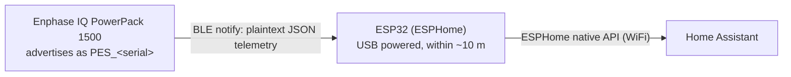

# Wiring / data flow

No physical wiring — the ESP32 bridges Bluetooth to Home Assistant over WiFi.

```mermaid
flowchart LR
    PP["Enphase IQ PowerPack 1500<br/>advertises as PES_&lt;serial&gt;"]
    ESP["ESP32 (ESPHome)<br/>USB powered, within ~10 m"]
    HA["Home Assistant"]

    PP -- "BLE notify: plaintext JSON telemetry" --> ESP
    ESP -- "ESPHome native API (WiFi)" --> HA
```

Power: any 5 V USB source. Range: keep the ESP32 within Bluetooth range (~10 m) of the unit.
