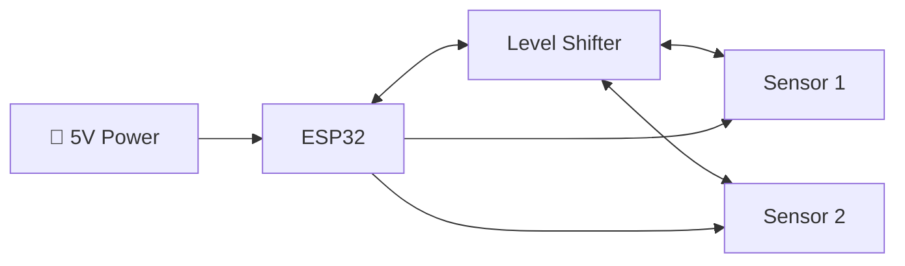
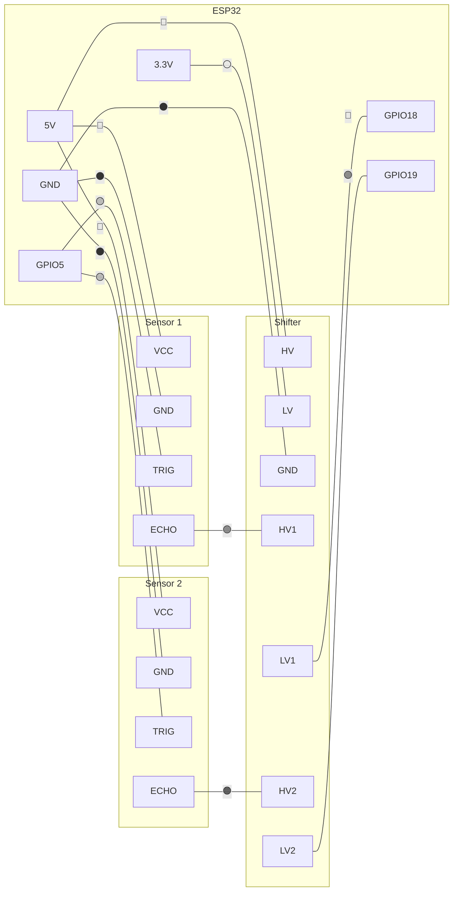

# Wiring Diagram

## Components

- **ESP32:** ELEGOO ESP-32 Dev Board (USB-C, CP2102)
- **Sensors:** 2x HC-SR04 ultrasonic
- **Level Shifter:** KeeYees 4-channel (3.3V ↔ 5V)
- **Power:** Arkare 5V 2A USB-C adapter

---

## System Block Diagram

High-level view of how components connect:

---

## Wiring Table

This is the actual build reference:

| Wire | Color | From | Pin | To | Pin |
|------|-------|------|-----|-----|-----|
| 1 | 🔴 Red | Adapter | + | ESP32 | 5V |
| 2 | ⚫ Black | Adapter | − | ESP32 | GND |
| 3 | 🔴 Red | ESP32 | 5V | Shifter | HV |
| 4 | ⚪ White | ESP32 | 3V3 | Shifter | LV |
| 5 | ⚫ Black | ESP32 | GND | Shifter | GND |
| 6 | 🔴 Red | ESP32 | 5V | Sensor 1 | VCC |
| 7 | ⚫ Black | ESP32 | GND | Sensor 1 | GND |
| 8 | 🟡 Yellow | ESP32 | IO5 | Sensor 1 | TRIG |
| 9 | 🟢 Green | Sensor 1 | ECHO | Shifter | HV1 |
| 10 | 🔵 Blue | Shifter | LV1 | ESP32 | IO18 |
| 11 | 🔴 Red | ESP32 | 5V | Sensor 2 | VCC |
| 12 | ⚫ Black | ESP32 | GND | Sensor 2 | GND |
| 13 | 🟡 Yellow | ESP32 | IO5 | Sensor 2 | TRIG |
| 14 | 🟠 Orange | Sensor 2 | ECHO | Shifter | HV2 |
| 15 | 🟣 Purple | Shifter | LV2 | ESP32 | IO19 |

---

## Connection Diagram

Shows the physical wiring with colors:

---

## Quick Reference

| ESP32 | → | Destination | Notes |
|-------|---|-------------|-------|
| 5V | → | Shifter HV, Sensor VCCs | Power rail |
| 3.3V | → | Shifter LV | Reference voltage |
| GND | → | All GNDs | Common ground |
| GPIO5 | → | Both TRIGs | Shared trigger |
| GPIO18 | ← | Shifter LV1 | Echo 1 (shifted) |
| GPIO19 | ← | Shifter LV2 | Echo 2 (shifted) |

---

## Why Level Shift ECHO Only?

- **TRIG:** ESP32 outputs 3.3V → HC-SR04 reads >2V as HIGH ✓
- **ECHO:** HC-SR04 outputs 5V → ESP32 GPIO max is 3.3V ✗ (needs shifter)
