# Wiring Diagram

This wiring assumes:

- ESP32: ELEGOO ESP-32 Dev Board (USB-C, CP2102)
- TRIG shared on GPIO5
- ECHO1 on GPIO18 (via shifter)
- ECHO2 on GPIO19 (via shifter)
- Arkare 5V 2A adapter connected through a 2-pin connector to ESP32 5V and GND
- KeeYees 4-channel logic level converter used only for the ECHO lines

## System Overview

```mermaid
flowchart TB
    subgraph POWER["⚡ Power Supply"]
        PSU["5V 2A Wall Adapter"]
    end

    subgraph MCU["🔲 ESP32 Dev Board"]
        direction LR
        ESP_5V["5V/VIN"]
        ESP_3V3["3.3V"]
        ESP_GND["GND"]
        ESP_GPIO5["GPIO5"]
        ESP_GPIO18["GPIO18"]
        ESP_GPIO19["GPIO19"]
    end

    subgraph SHIFTER["⚡→ Level Shifter"]
        direction LR
        HV["HV (5V side)"]
        LV["LV (3.3V side)"]
    end

    subgraph SENSORS["📡 Ultrasonic Sensors"]
        direction LR
        SR04_1["HC-SR04 #1"]
        SR04_2["HC-SR04 #2"]
    end

    %% Power distribution (5V)
    PSU -->|"5V"| ESP_5V
    ESP_5V -->|"5V"| HV
    ESP_5V -->|"5V VCC"| SR04_1
    ESP_5V -->|"5V VCC"| SR04_2

    %% 3.3V reference
    ESP_3V3 -->|"3.3V"| LV

    %% Ground (common)
    ESP_GND ===|"GND"| SHIFTER
    ESP_GND ===|"GND"| SR04_1
    ESP_GND ===|"GND"| SR04_2

    %% Signal: TRIG (3.3V direct - ESP32 output is fine for HC-SR04)
    ESP_GPIO5 -->|"TRIG"| SR04_1
    ESP_GPIO5 -->|"TRIG"| SR04_2

    %% Signal: ECHO (5V→3.3V via shifter)
    SR04_1 -->|"ECHO 5V"| HV
    SR04_2 -->|"ECHO 5V"| HV
    LV -->|"ECHO 3.3V"| ESP_GPIO18
    LV -->|"ECHO 3.3V"| ESP_GPIO19
```

## Detailed Pin-to-Pin Connections

## Wire Color Suggestion

| Color  | Signal      | From              | To                    |
|--------|-------------|-------------------|-----------------------|
| 🔴 Red    | 5V Power    | Adapter +         | ESP32 5V, Sensors VCC, Shifter HV |
| ⚫ Black  | Ground      | Adapter -         | All GND pins          |
| 🟡 Yellow | TRIG        | ESP32 GPIO5       | Both HC-SR04 TRIG     |
| 🟢 Green  | ECHO1 (5V)  | HC-SR04 #1 ECHO   | Shifter HV1           |
| 🔵 Blue   | ECHO1 (3.3V)| Shifter LV1       | ESP32 GPIO18          |
| 🟠 Orange | ECHO2 (5V)  | HC-SR04 #2 ECHO   | Shifter HV2           |
| 🟣 Purple | ECHO2 (3.3V)| Shifter LV2       | ESP32 GPIO19          |
| ⚪ White  | 3.3V Ref    | ESP32 3.3V        | Shifter LV            |

## Pin Mapping Summary

| ESP32 Pin | Direction | Connected To            | Notes                          |
|-----------|-----------|-------------------------|--------------------------------|
| 5V/VIN    | IN        | Power adapter 5V        | Powers entire system           |
| 3.3V      | OUT       | Level shifter LV        | Reference for low side         |
| GND       | -         | All grounds             | Common ground                  |
| GPIO5     | OUT       | Both HC-SR04 TRIG       | Shared trigger (fires both)    |
| GPIO18    | IN        | Level shifter LV1       | ECHO from sensor 1 (shifted)   |
| GPIO19    | IN        | Level shifter LV2       | ECHO from sensor 2 (shifted)   |

## Why Level Shift Only ECHO?

- **TRIG (ESP32 → Sensor):** ESP32 outputs 3.3V, but HC-SR04 treats anything >2V as HIGH. Works fine without shifting.
- **ECHO (Sensor → ESP32):** HC-SR04 outputs 5V, but ESP32 GPIOs are **not 5V tolerant**. Direct connection risks damage. The level shifter drops this to safe 3.3V.
