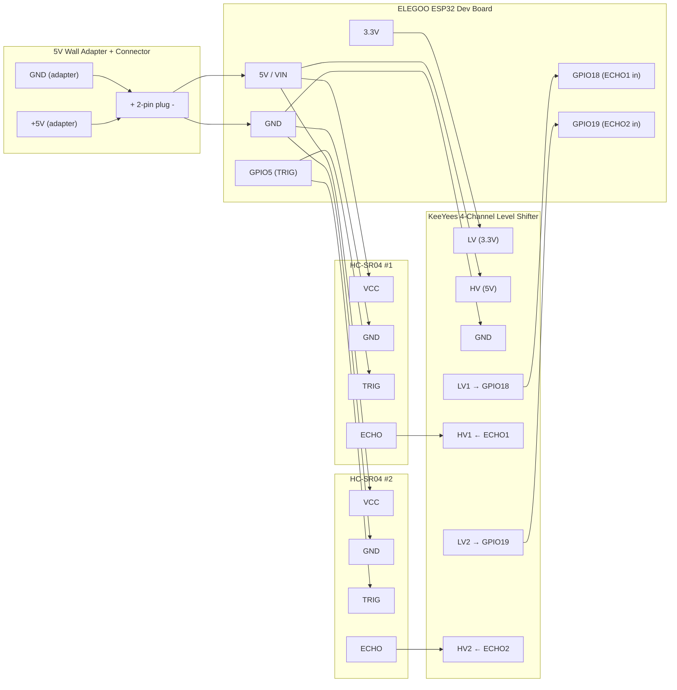

# Wiring Diagram

This wiring assumes:

- ESP32: ELEGOO ESP-32 Dev Board (USB-C, CP2102)
- TRIG shared on GPIO5
- ECHO1 on GPIO18 (via shifter)
- ECHO2 on GPIO19 (via shifter)
- Arkare 5V 2A adapter connected through a 2-pin connector to ESP32 5V and GND
- KeeYees 4-channel logic level converter used only for the ECHO lines

## Mermaid Diagram

## Pin Mapping

- ESP32 GPIO5 → TRIG (both HC-SR04 modules)
- ESP32 GPIO18 ← ECHO1 via level shifter
- ESP32 GPIO19 ← ECHO2 via level shifter
- ESP32 5V/VIN ← Arkare 5V adapter
- ESP32 GND ← Arkare adapter GND
- All GNDs common: ESP32, both sensors, level shifter
