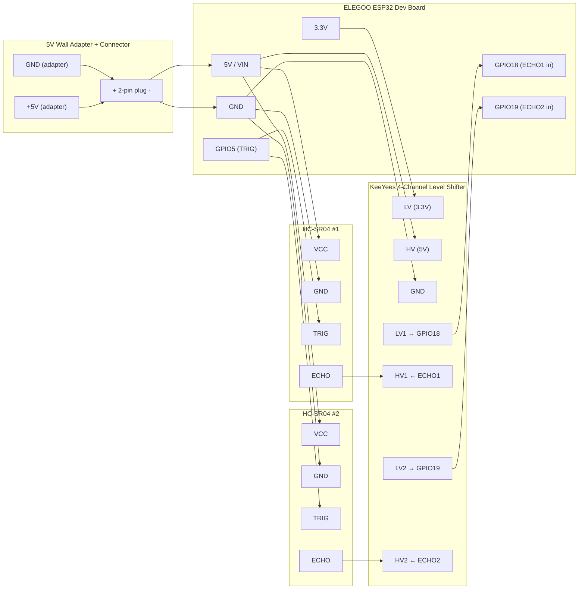

# Wiring Diagram (Mermaid Source)

See `docs/wiring-diagram.md` for the rendered version.

```mermaid
flowchart LR
    subgraph PWR["5V Wall Adapter + Connector"]
        WA["+5V (adapter)"]
        WG["GND (adapter)"]
        CONN["+ 2-pin plug -"]
    end

    subgraph ESP["ELEGOO ESP32 Dev Board"]
        V5["5V / VIN"]
        EGND["GND"]
        V33["3.3V"]
        GPIO5["GPIO5 (TRIG)"]
        GPIO18["GPIO18 (ECHO1 in)"]
        GPIO19["GPIO19 (ECHO2 in)"]
    end

    subgraph LVL["KeeYees 4-Channel Level Shifter"]
        LV["LV (3.3V)"]
        HV["HV (5V)"]
        LGND["GND"]
        LV1["LV1 → GPIO18"]
        HV1["HV1 ← ECHO1"]
        LV2["LV2 → GPIO19"]
        HV2["HV2 ← ECHO2"]
    end

    subgraph S1["HC-SR04 #1"]
        S1V["VCC"]
        S1G["GND"]
        S1T["TRIG"]
        S1E["ECHO"]
    end

    subgraph S2["HC-SR04 #2"]
        S2V["VCC"]
        S2G["GND"]
        S2T["TRIG"]
        S2E["ECHO"]
    end

    WA --> CONN
    WG --> CONN

    CONN --> V5
    CONN --> EGND

    V5 --> HV
    V5 --> S1V
    V5 --> S2V

    V33 --> LV

    EGND --> LGND
    EGND --> S1G
    EGND --> S2G

    GPIO5 --> S1T
    GPIO5 --> S2T

    S1E --> HV1
    LV1 --> GPIO18

    S2E --> HV2
    LV2 --> GPIO19
```
