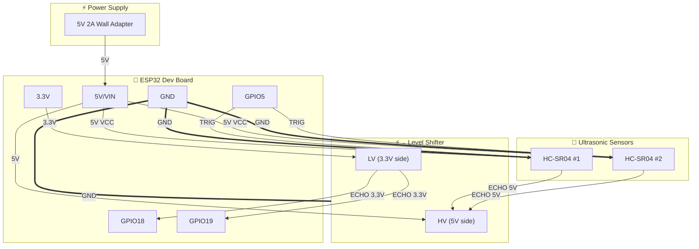
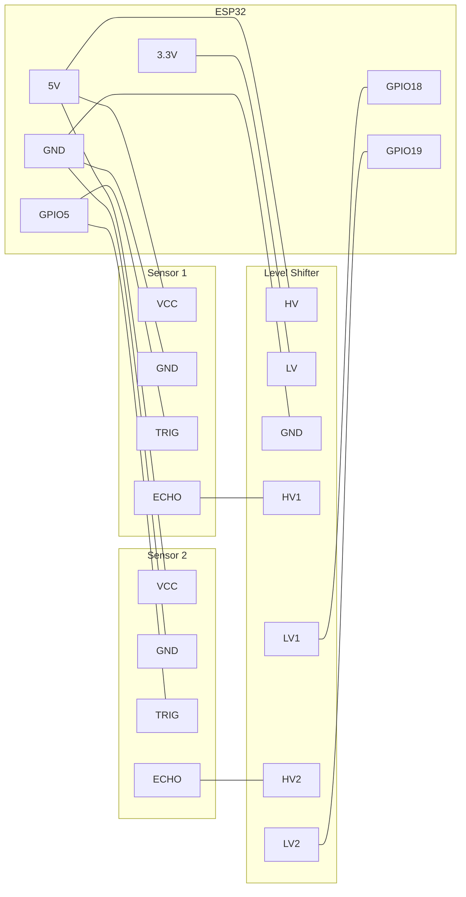

# Wiring Diagram (Mermaid Source)

See `docs/wiring-diagram.md` for the full documentation with tables.

## System Overview

```mermaid
flowchart TB
    subgraph POWER["⚡ Power Supply"]
        PSU["5V 2A Wall Adapter"]
    end

    subgraph MCU["🔲 ESP32 Dev Board"]
        direction LR
        ESP_5V["5V/VIN"]
        ESP_3V3["3.3V"]
        ESP_GND["GND"]
        ESP_GPIO5["GPIO5"]
        ESP_GPIO18["GPIO18"]
        ESP_GPIO19["GPIO19"]
    end

    subgraph SHIFTER["⚡→ Level Shifter"]
        direction LR
        HV["HV (5V side)"]
        LV["LV (3.3V side)"]
    end

    subgraph SENSORS["📡 Ultrasonic Sensors"]
        direction LR
        SR04_1["HC-SR04 #1"]
        SR04_2["HC-SR04 #2"]
    end

    %% Power distribution (5V)
    PSU -->|"5V"| ESP_5V
    ESP_5V -->|"5V"| HV
    ESP_5V -->|"5V VCC"| SR04_1
    ESP_5V -->|"5V VCC"| SR04_2

    %% 3.3V reference
    ESP_3V3 -->|"3.3V"| LV

    %% Ground (common)
    ESP_GND ===|"GND"| SHIFTER
    ESP_GND ===|"GND"| SR04_1
    ESP_GND ===|"GND"| SR04_2

    %% Signal: TRIG (3.3V direct - ESP32 output is fine for HC-SR04)
    ESP_GPIO5 -->|"TRIG"| SR04_1
    ESP_GPIO5 -->|"TRIG"| SR04_2

    %% Signal: ECHO (5V→3.3V via shifter)
    SR04_1 -->|"ECHO 5V"| HV
    SR04_2 -->|"ECHO 5V"| HV
    LV -->|"ECHO 3.3V"| ESP_GPIO18
    LV -->|"ECHO 3.3V"| ESP_GPIO19
```

## Detailed Pin-to-Pin

```mermaid
flowchart LR
    subgraph ESP["ESP32"]
        E_5V["5V"]
        E_3V3["3.3V"]
        E_GND["GND"]
        E_G5["GPIO5"]
        E_G18["GPIO18"]
        E_G19["GPIO19"]
    end

    subgraph LVL["Level Shifter"]
        L_HV["HV"]
        L_LV["LV"]
        L_GND["GND"]
        L_HV1["HV1"]
        L_LV1["LV1"]
        L_HV2["HV2"]
        L_LV2["LV2"]
    end

    subgraph S1["Sensor 1"]
        S1_VCC["VCC"]
        S1_GND["GND"]
        S1_TRIG["TRIG"]
        S1_ECHO["ECHO"]
    end

    subgraph S2["Sensor 2"]
        S2_VCC["VCC"]
        S2_GND["GND"]
        S2_TRIG["TRIG"]
        S2_ECHO["ECHO"]
    end

    %% 5V Power
    E_5V --- L_HV
    E_5V --- S1_VCC
    E_5V --- S2_VCC

    %% 3.3V Reference
    E_3V3 --- L_LV

    %% Ground
    E_GND --- L_GND
    E_GND --- S1_GND
    E_GND --- S2_GND

    %% TRIG signals
    E_G5 --- S1_TRIG
    E_G5 --- S2_TRIG

    %% ECHO through shifter
    S1_ECHO --- L_HV1
    L_LV1 --- E_G18
    S2_ECHO --- L_HV2
    L_LV2 --- E_G19
```
