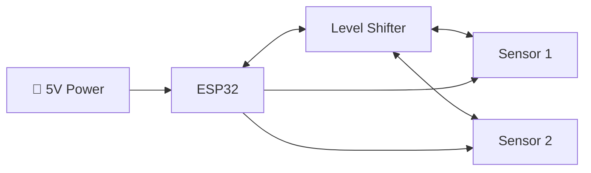
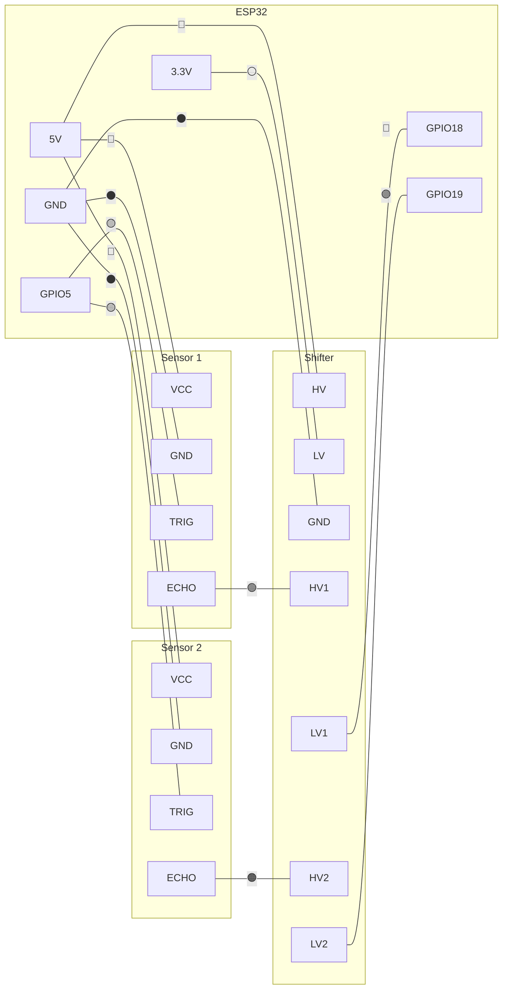

# Wiring Diagram (Mermaid Source)

See `docs/wiring-diagram.md` for full documentation with wiring table.

## System Block Diagram

```mermaid
flowchart LR
    PSU[🔌 5V Power] --> ESP32
    ESP32 <--> SHIFT[Level Shifter]
    SHIFT <--> S1[Sensor 1]
    SHIFT <--> S2[Sensor 2]
    ESP32 --> S1
    ESP32 --> S2
```

## Connection Diagram

```mermaid
flowchart LR
    subgraph ESP[ESP32]
        E5[5V]
        E3[3.3V]
        EG[GND]
        G5[GPIO5]
        G18[GPIO18]
        G19[GPIO19]
    end

    subgraph SHIFT[Shifter]
        HV
        LV
        SG[GND]
        HV1
        LV1
        HV2
        LV2
    end

    subgraph S1[Sensor 1]
        V1[VCC]
        G1[GND]
        T1[TRIG]
        E1[ECHO]
    end

    subgraph S2[Sensor 2]
        V2[VCC]
        G2[GND]
        T2[TRIG]
        E2[ECHO]
    end

    E5 ---|"🔴"| HV
    E3 ---|"⚪"| LV
    EG ---|"⚫"| SG

    E5 ---|"🔴"| V1
    EG ---|"⚫"| G1
    G5 ---|"🟡"| T1
    E1 ---|"🟢"| HV1
    LV1 ---|"🔵"| G18

    E5 ---|"🔴"| V2
    EG ---|"⚫"| G2
    G5 ---|"🟡"| T2
    E2 ---|"🟠"| HV2
    LV2 ---|"🟣"| G19
```
